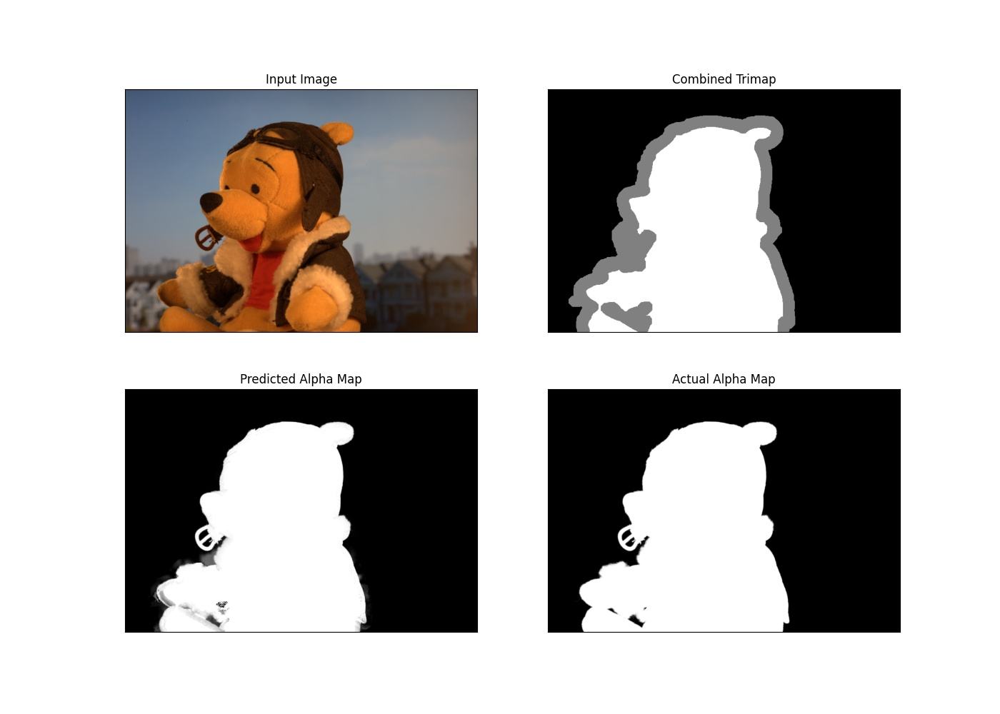
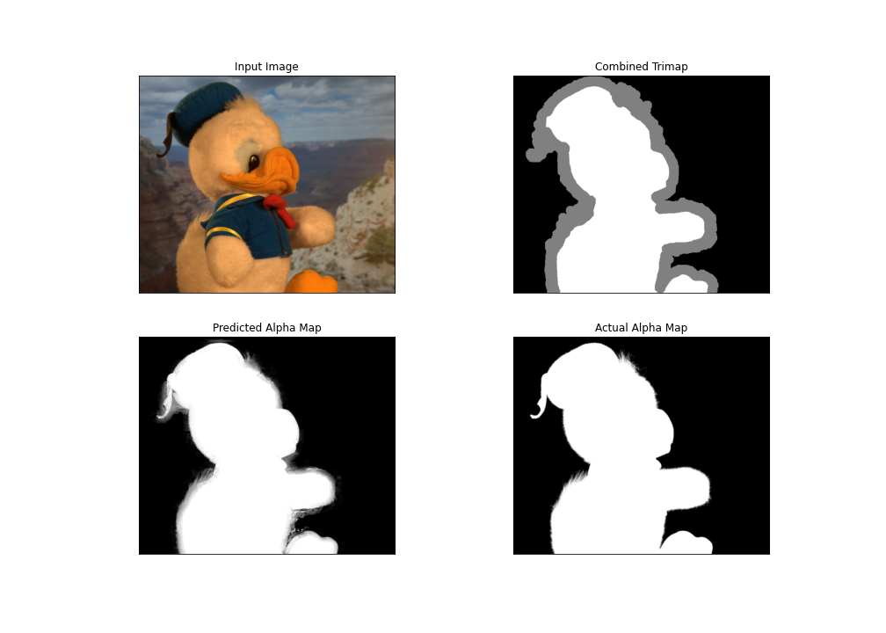

## Bayesian matting

This repository is a python implementation of paper [A Bayesian approach to digital matting](https://ieeexplore.ieee.org/document/990970). A pdf report explaning the math behind and few example output has been attached. 

### Implementation details
I have used a queue to store the unknown pixels and iterate over them one by one. While iterating if there are less than 15 known neighbour pixels, then the point is skipped and re-added at the end of the queue. 

### Dataset
Few images along with its trimap are available here [drive link](https://drive.google.com/drive/folders/1a2dhdoTbBg50RkRRZtLqxllToQXcgphm?usp=sharing)

### Results

